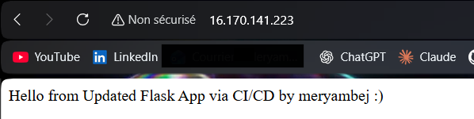

# Automated Flask Deployment on AWS EC2

A production-ready continuous integration and continuous deployment pipeline demonstrating automated Docker containerization and deployment using GitHub Actions self-hosted runner on AWS EC2.



## Repository Details

**Name:** Automated-Flask-Deployment-EC2-AWS

**Description:** Automated CI/CD pipeline for Flask application deployment using GitHub Actions self-hosted runner, Docker Hub, and AWS EC2 infrastructure

**Topics:** ci-cd, github-actions, docker, aws-ec2, flask, python, devops, automation, containerization, deployment, self-hosted-runner, docker-hub, infrastructure, continuous-integration, continuous-deployment

## Table of Contents

- [Overview](#overview)
- [Architecture](#architecture)
- [Prerequisites](#prerequisites)
- [Infrastructure Setup](#infrastructure-setup)
- [Project Structure](#project-structure)
- [Application Files](#application-files)
- [Deployment](#deployment)
- [Verification](#verification)
- [Workflow Explanation](#workflow-explanation)
- [Security Considerations](#security-considerations)


## Overview

This project implements an enterprise-grade automated deployment pipeline that demonstrates modern DevOps practices. Every code push triggers a complete CI/CD workflow that builds a Docker container, pushes it to Docker Hub, and deploys it to an AWS EC2 instance using a GitHub Actions self-hosted runner. The solution showcases infrastructure automation, containerization, and continuous deployment in a real-world cloud environment.

### Key Features

- Automated build and deployment on every git push
- Docker containerization for consistent environments
- Self-hosted GitHub Actions runner on EC2
- Zero-downtime deployment with container orchestration
- Secure credential management with GitHub Secrets
- Production-ready Flask web application

## Architecture

The pipeline consists of the following components:

- **GitHub Actions**: Orchestrates the CI/CD workflow
- **Self-Hosted Runner**: Executes workflows directly on the EC2 instance
- **Docker**: Containerizes the application for consistent deployments
- **Docker Hub**: Stores and distributes container images
- **AWS EC2**: Hosts both the runner and the deployed application
- **Flask Application**: Lightweight Python web application

## Prerequisites

- AWS Account with EC2 access
- GitHub Account
- Docker Hub Account
- Basic knowledge of Git, Docker, and AWS

## Infrastructure Setup

### Step 1: Provision EC2 Instance

Launch an EC2 instance with the following specifications:

- **Operating System**: Ubuntu 22.04 LTS
- **Instance Type**: t2.micro or t3.micro
- **Security Group Rules**:
  - SSH (Port 22): For remote access
  - HTTP (Port 80): For application access

### Step 2: Install Docker

Connect to your EC2 instance via SSH and execute the following commands:

```bash
sudo apt update
sudo apt install docker.io -y
sudo systemctl start docker
sudo systemctl enable docker
sudo usermod -aG docker ubuntu
```

Log out and log back in for group changes to take effect:

```bash
exit
# Reconnect via SSH
docker ps
```

### Step 3: Configure GitHub Secrets

Navigate to your GitHub repository and configure the following secrets:

1. Go to **Settings** → **Secrets and variables** → **Actions**
2. Click **New repository secret**
3. Add the following secrets:

| Secret Name | Value |
|------------|-------|
| DOCKER_USERNAME | Your Docker Hub username |
| DOCKER_PASSWORD | Your Docker Hub access token |

### Step 4: Install GitHub Self-Hosted Runner

1. In your GitHub repository, navigate to **Settings** → **Actions** → **Runners**
2. Click **New self-hosted runner**
3. Select **Linux** and **x64** architecture
4. Copy and execute the provided installation commands on your EC2 instance
5. Start the runner service

## Project Structure

```
.
├── app.py
├── requirements.txt
├── Dockerfile
└── .github/
    └── workflows/
        └── deploy.yml
```

## Application Files

### app.py

```python
from flask import Flask

app = Flask(__name__)

@app.route("/")
def hello():
    return "Hello from Flask running in Docker!"

if __name__ == "__main__":
    app.run(host="0.0.0.0", port=5000)
```

### requirements.txt

```
flask
```

### Dockerfile

```dockerfile
FROM python:3.11-slim

WORKDIR /app

COPY requirements.txt .
RUN pip install -r requirements.txt

COPY app.py .

EXPOSE 5000

CMD ["python", "app.py"]
```

### GitHub Actions Workflow

Create `.github/workflows/deploy.yml`:

```yaml
name: Self-Hosted-Ubuntu-Runner-DockerHub

on:
  push:

jobs:
  build:
    runs-on: self-hosted

    steps:
      - name: Checkout code
        uses: actions/checkout@v4

      - name: Log in to Docker Hub
        uses: docker/login-action@v2
        with:
          username: ${{ secrets.DOCKER_USERNAME }}
          password: ${{ secrets.DOCKER_PASSWORD }}

      - name: Build Docker image
        run: |
          docker build -t ${{ secrets.DOCKER_USERNAME }}/flask-app:latest .

      - name: Push Docker image
        run: |
          docker push ${{ secrets.DOCKER_USERNAME }}/flask-app:latest

      - name: Stop old container
        run: |
          docker stop flask-app || true
          docker rm flask-app || true

      - name: Run new container
        run: |
          docker run -d -p 80:5000 --name flask-app \
            ${{ secrets.DOCKER_USERNAME }}/flask-app:latest

```

## Deployment

### Deploy the Application

1. Initialize Git repository (if not already done):

```bash
git init
git remote add origin <your-repository-url>
```

2. Commit and push your code:

```bash
git add .
git commit -m "Add automated deployment pipeline"
git push origin main
```

## Verification

### Check GitHub Actions

1. Navigate to your repository's **Actions** tab
2. Verify the workflow executed successfully
3. Confirm the runner is listed as "self-hosted"

### Verify on EC2

Execute the following commands on your EC2 instance:

```bash
docker images
docker ps
```

Expected output should show:
- Image: `<dockerhub-username>/flask-app:latest`
- Running container named `flask-app`

### Access the Application

Open your web browser and navigate to:

```
http://<EC2_PUBLIC_IP>
```

You should see: "Hello from Flask running in Docker!"

## Workflow Explanation

The CI/CD pipeline executes the following steps on every push:

1. **Code Checkout**: Retrieves the latest code from the repository
2. **Docker Hub Authentication**: Logs into Docker Hub using stored secrets
3. **Image Build**: Creates a new Docker image from the Dockerfile
4. **Image Push**: Uploads the image to Docker Hub repository
5. **Container Cleanup**: Stops and removes the previous container
6. **Container Deployment**: Launches a new container with the updated image

## Security Considerations

- Docker Hub credentials are stored as GitHub encrypted secrets
- Never commit sensitive credentials to the repository
- Stop EC2 when not in use: Stop your instance when you're done testing to avoid unnecessary charges :)


